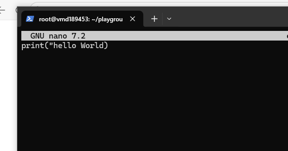
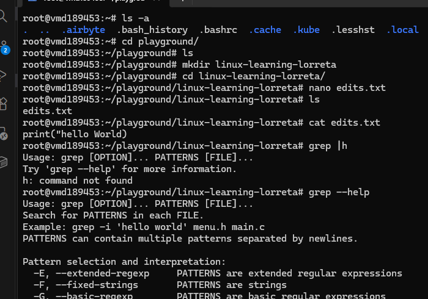

# Day 01 - Linux Fundamentals/ Basics of Linux Commands

## Objective

What was the goal for today?
Today is for reading around the fundamentals that Videos ordinarily would skip. Then since i am not a total beginner, guage my level of usage against the most popular linux commands as outlined by Colt (on the freecode Youtube video)

My usage is pretty decent, at least for someone who began her DE journey not quite long ago. I have used and have a fair idea of 18 commands. You'll agree with me that it is not so bad?
---

## What I Learned
Out of the basic things written on the GeeksforGeeks blog, the Linux Kernel struck a chord. Primarily because i have heard it being mentioned quite a lot.

- The kernel is one out of the 3 main components of a Linux Distro (the other 2 are: system libraries, and essential software tools).

- This is the visual on my head: I run a python script. Now, it requires some fraction of the CPU, memory, etc. My python commands will not grab the resources it needs directly, it goes to the kernel. The kernel than allocates the required resources needed to run the job. Now, in the case that multiple scripts are running, it is also the kernel that ensures there is no overwrite, that things don't mix up, ie isolation. 
- 
- 

---

## What I Built / Practiced

- Without watching the video yet, i tasked myself to do something with the 18 familiar commands:
1. whoami
2. rmdir
3. ps
4. rm
5. clear
6. touch
7. cat
9. su
10. ls and its variant: ls -a
11. echo
12. nano
13. cd
14. mkdir
15. chmod
16. sudo
17. pwd
18. grep
- 

---

## Challenges Faced

- 
- 

---

## Key Takeaways

- 
- 

---

## Resources

- Linux fundamentals[https://www.geeksforgeeks.org/linux-unix/linux-tutorial/]
- Linux file system [https://github.com/Najeeb-Sulaiman/linux-and-bash-scripting-guide/blob/main/01-linux-fundamentals/Linux%20and%20Bash%20Scripting.pdf]
- 50 most popular Linux Commands[https://youtu.be/ZtqBQ68cfJc?si=xuC88vOCYoho8nyR]
---

## Output

