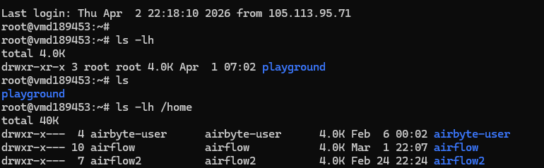
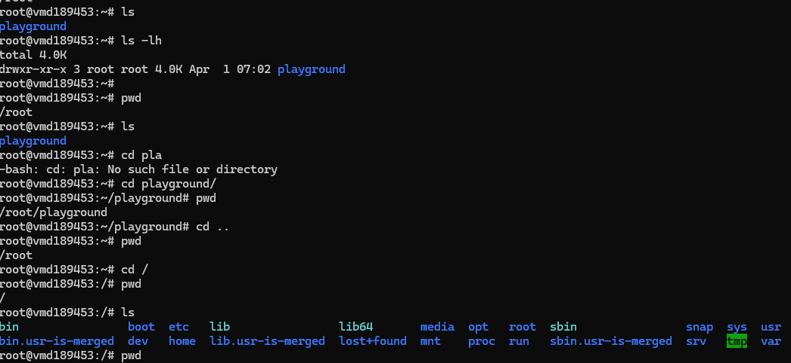
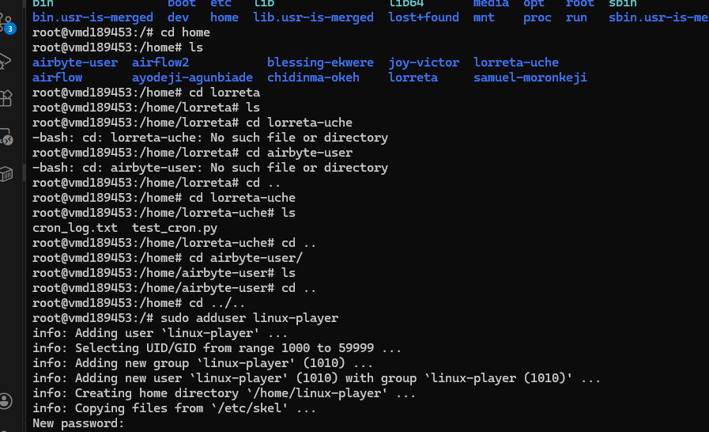
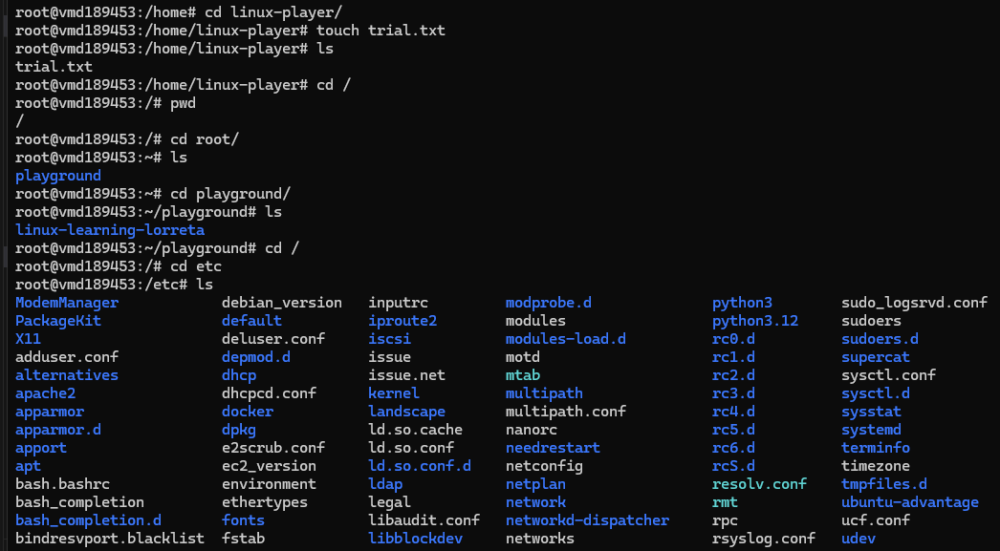
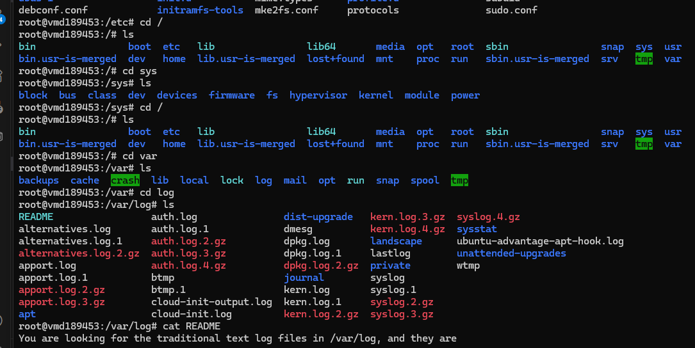

# Day 02 - Linux File System

## Objective

What was the goal for today?
- Know where I am
- Know how to move
- Know what exists where I am
---

## What I Learned
1. Know where I am.

To understand where I am, I either run the "pwd" or "whoami" commands. At first I found myself in the "/root" and it is flagged by "~". My sources called it home. But I did not understand. So I needed to move around.

2. Know how to move.

To move, I used the "cd" and its variants such as "cd .." to move one step back. Doing this landed me inside the "/", called root. Also running the "cd /" still landed me inside the root straight up. I still did not understand their differences. 

- I needed to understand the differences between the root and home directory. So I explored more. I decided to understand what exists where I am. 

3. Know what exists where I am.

To know what exists where i am, I ran the "ls", "ls -a", "ls -lh", and "ls -lh /home"
- ls displays all files in my current directory
- ls -a displays all hidden files
- ls -lh displays the files in long and human readable format: shows the file permissions, size of the file, date modified, etc.

Moving into the /, and running ls, i noticed that the files inside ~ do not appear here. 
Because the / is like the entire building, it houses files including home, /bin, /etc and so on. 

These make up the linux file system also called Filesystem Hierarchy Standard (FHS). I will be describing these shortly. 

## Filesystem Hierarchy Standard (FHS)
1. /home — Users live here
Right now, I am logged in as a root user. If I create other users (like accounts for different people to use same system), those people and their files will live here. 

2. /root — Admin (I) live here
This is where i live since i am logged in as the owner of the account. If I "ls", it displays all my files.

3. /etc — Configuration files
This one houses the settings

4. /var - activity logs
This houses the logs of my activities.

5. /usr - Houses installed apps
Where system tools live

6. /tmp - for temporary files

---

## What I Built / Practiced

- Navigating around directories
- Listing directories and files in my working path
- Created Users: entered into each user directory. Created files for them using "touch"
- moved into each file hierachy in the root. Explored what each contains

---

## Challenges Faced

- I elt that there the files inside each file hierachy are much for one to remember. Like when you are having an issue, where do you look? 

- Going into the logs, i expected to see  the experienms i am doing so far. But it housed other sub-folders.
- 

---

## Key Takeaways

- It is the right practice to create user for each tooling. Like airbyte-user, airflow-user. 
- Understanding the file structure helps in situations like debugging where you have to look inside the var/logs
---

## Resources

- Linux file system[https://github.com/Najeeb-Sulaiman/linux-and-bash-scripting-guide/tree/main/02-linux-commands]

---

## Output
navigating and understanding where I am:

