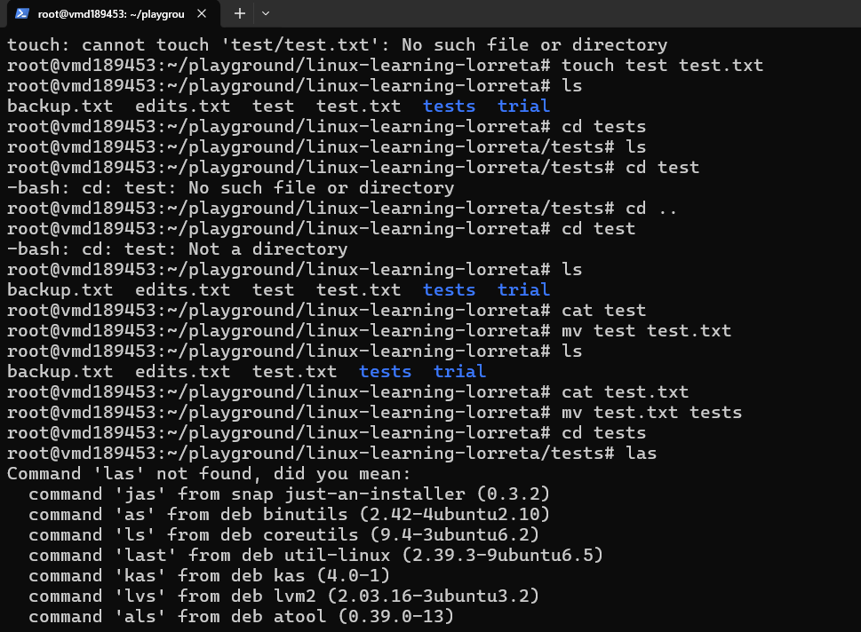
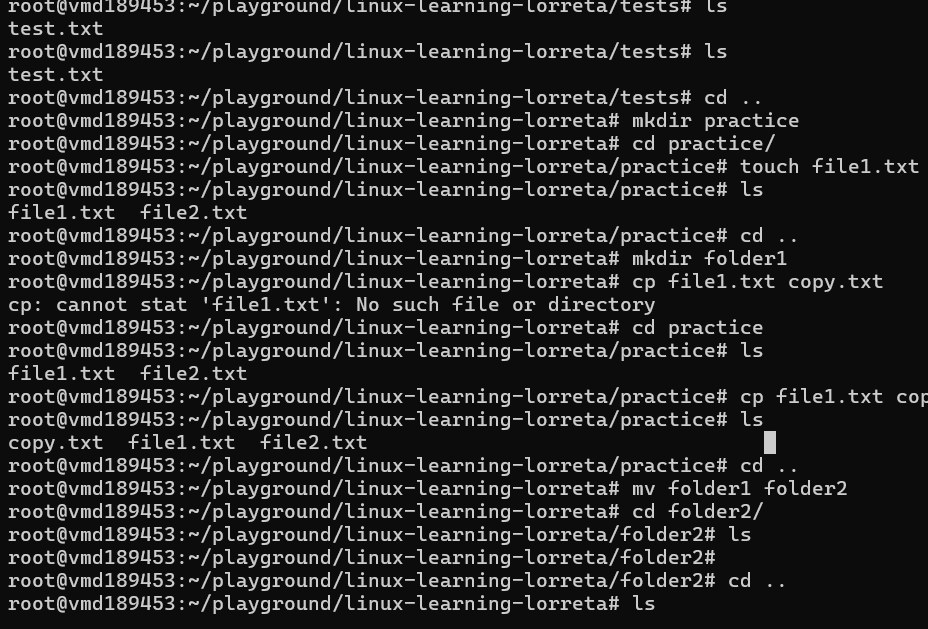
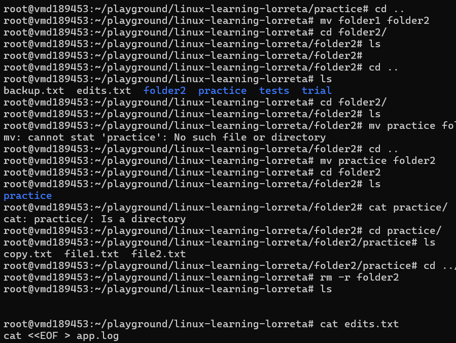
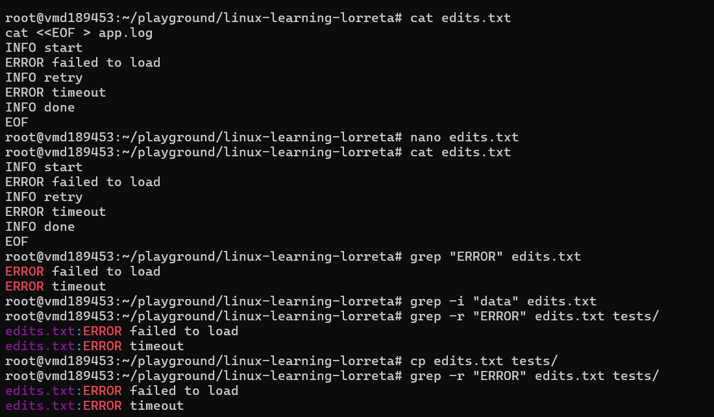

# Day 03 - File Commands

## Objective

What was the goal for today?
- manipulate files and directories
- File Content Search and Text Processing
- Sorting, Counting, and Filtering Data

---

## What I Learned

1. manipulate files and directories
- cp: copy content of one file into another. The copied content overwrites what was previously therein
- cp -r: Copy a directory and everything inside it
- mv: move the content of a file into another. if the file does not exist, then it will craete it before moving
- rm: delete a file
- rm -r: delete and emptied to the directory
- rm -i: delete the file interactively. ask before removing
- rmdir: Remove empty folder. if the folder contains any files, it will not delete it.

2. File Content Search and Text Processing
- grep: Search inside a file. eg grep "word" filename
- grep -i: Case-insensitive search
- grep -r: search in many files inside folders

3. Sorting, Counting, and Filtering Data

- wc: Count things inside a file
6 13 71 edits.txt
this means 
6 → lines
13 → words
71 → characters

---

## What I Built / Practiced

- I created directories and files. Attempted moving, copying and removing them one after the other
---

## Challenges Faced

- after i "nano" and edit the file, i always found it hard to exit the editor. i learned to just ctrl + o and press Enter
- confusing files with directories and vice versa

---

## Key Takeaways

- 

---

## Resources

- Linux file system[https://github.com/Najeeb-Sulaiman/linux-and-bash-scripting-guide/tree/main/02-linux-commands]

---

## Output

