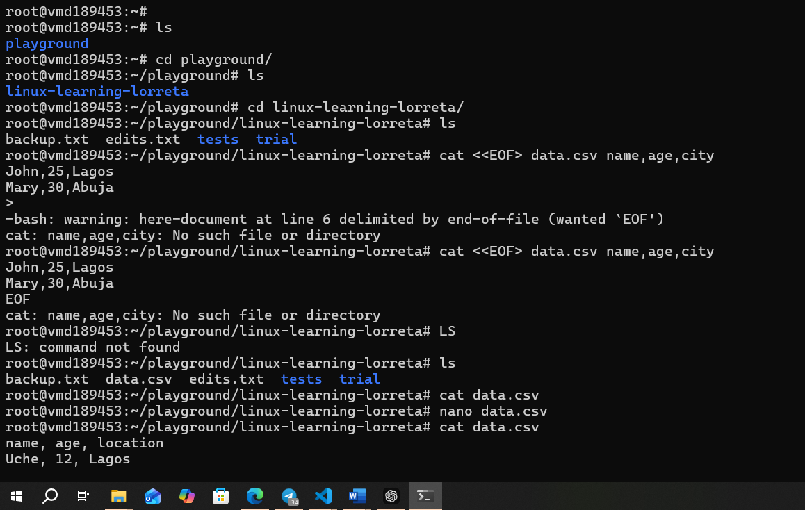
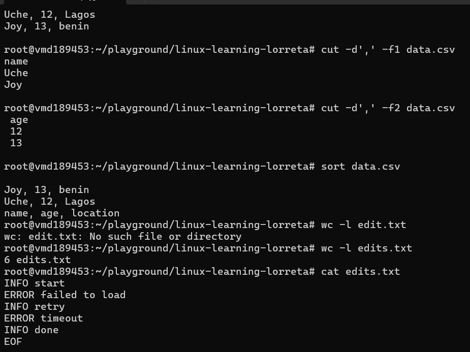

# Day 04 - Linux Commands

## Objective

What was the goal for today?
- more practice with Sorting, Counting, and Filtering Data
---

## What I Learned

- cut: to display across columns (fields). it does not display across rows eg cut -d',' -f1 data.csv
- sort: arranges it in ascending order
- uniq: Remove duplicates
- wc: Count lines, words, characters
- awk: More powerful than cut. still a bit confusing
---

## What I Built / Practiced

- To practise the cut command, I created a file "data.csv" and wrote lines of code in it. I used the EOF command where the first one signals that everything next lines should be taken as input till another EOF appears. see example: 

cat <<EOF > data.csv

name,age,city

John,25,Lagos

Mary,30,Abuja

EOF
- 

---

## Challenges Faced

- i find it hard to understand awk and sed
- 

---

## Key Takeaways

---

## Resources

- Linux file system[https://github.com/Najeeb-Sulaiman/linux-and-bash-scripting-guide/tree/main/02-linux-commands]

---

## Output

