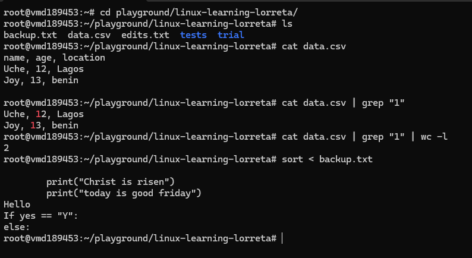

# Day 05 - Redirection and Pipes || Chaining and Combining Commands

## Objective

What was the goal for today?

- Understand command in Linux used in three data streams: stdin, stdout, stderr
- Learn to chain commands for sequential, individual order
---

## What I Learned
1. stdin:

When we write a command, that is the input. 

2. stdout:

What displays on screen (terminal is standard output). If I don't want it to appear on the screen, then i redirect it.

Example: echo "Hello". The "Hello" here is the standard input. The output is still Hello as shown on my screen. 

Now instead of displaying this output on my screen, I can **redirect** it to a file: echo "Hello" file.txt

Using the ">" writes into the file and overwrites what was there. However, ">>" adds to file but don’t replace.

3. Pipes (|): Instead of saving to a file, I can send output directly to another command. 
syntax: command1 | command2.

This implies the output of command1 is sent as input for command2

4. < : to send the content of a file as input to a command

5. - &&: “ONLY if success”

Assuming you have multiple commands, the second one runs if and if the first was successful

eg. mkdir logs && echo "you are doing well"

I noticed the first it ran successfully and print the expected output. Howvever, the second time, it threw an error beacuse logs exists and so the echo part did not run.
---

## What I Built / Practiced

- ">"
- ">>"
- <
- |
- &&: 

---

## Challenges Faced

- 
- 

---

## Key Takeaways

- 
- 

---

## Resources

- Linux file system[https://github.com/Najeeb-Sulaiman/linux-and-bash-scripting-guide/tree/main/02-linux-commands]

---

## Output

