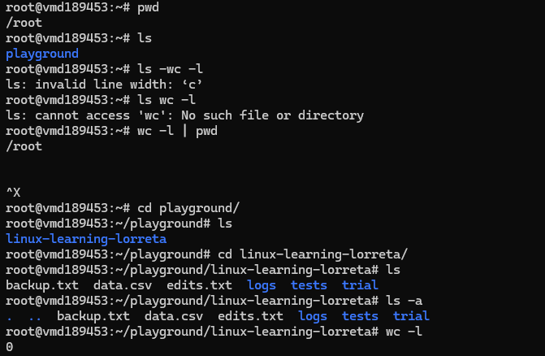
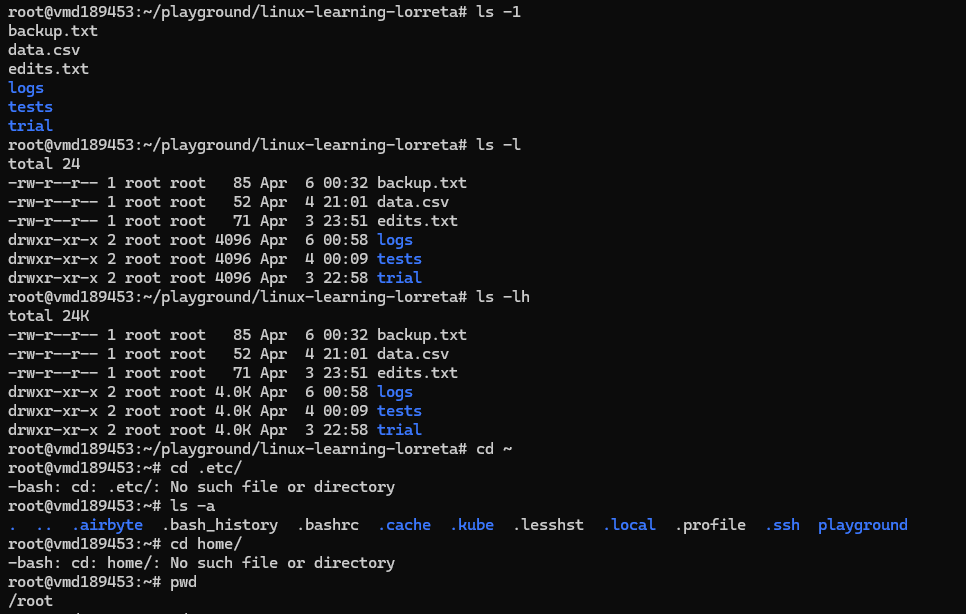
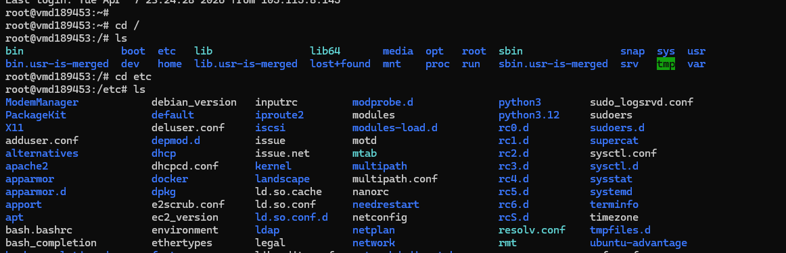
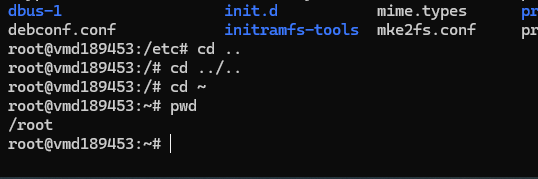

# Day 07 - Practical Exercises

## Objective

What was the goal for today?

- Attempt all the questions
---

## What I Learned

- 
- 
- 

---

## What I Built / Practiced

- Navigating the File System
1. Print your current working directory.

2. List all files and folders in the current directory:

-  Once normally : ls
- Once with one item per line : ls -1
- Once with detailed info (permissions, size, owner, etc.) : ls -lh

3. Navigate to /etc (or any system directory), then:

- Move up one level: cd ..

- Move up two levels: cd ../..

- Return to your home directory: cd ~

4. Navigate to the root directory / and list its contents.

5. Use TAB autocompletion to type a directory path faster.

---

## Challenges Faced

- 
- 

---

## Key Takeaways

- 
- 

---

## Resources
- Linux file system[https://github.com/Najeeb-Sulaiman/linux-and-bash-scripting-guide/tree/main/02-linux-commands]
 
---

## Output

