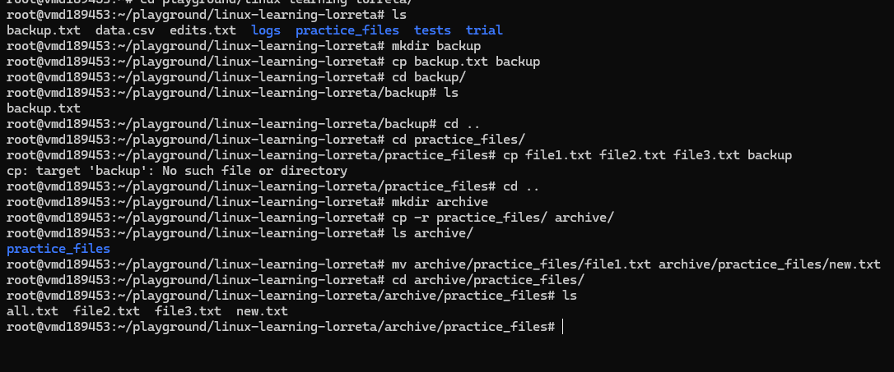

# Day 08 - Practical Exercises

## Objective

What was the goal for today?
- Attempt the remainder of the questions
---

## What I Learned

### Copying, Moving, and Deleting

- Create a new directory named backup: mkdir backup

- Copy one of your text files into the backup folder: cp backup.txt backup

- Copy the entire practice_files directory into a new folder called archive recursively::::mkdir archive. :::cp -r practice_files archive

- Rename a file inside archive mv archive/practice/file1.txt archive/practice/new.txt

- Move a file from backup back to practice_files::::mv backup/backup.txt practice_files

- Create a new folder temp_data and an empty file inside it.

- Try deleting the file.

- Try deleting the entire temp_data folder:::: rmdir

- In one command:

    1. Create a directory named project/logs/2025.
    2. Create a new file system.log inside it. 

---

## What I Built / Practiced

- 
- 

---

## Challenges Faced

- 
- 

---

## Key Takeaways

- cp -r copies the folder and its content into specified folder
- mv can also be used to rename
- 

---

## Resources

- Linux file system[https://github.com/Najeeb-Sulaiman/linux-and-bash-scripting-guide/tree/main/02-linux-commands]

---

## Output

