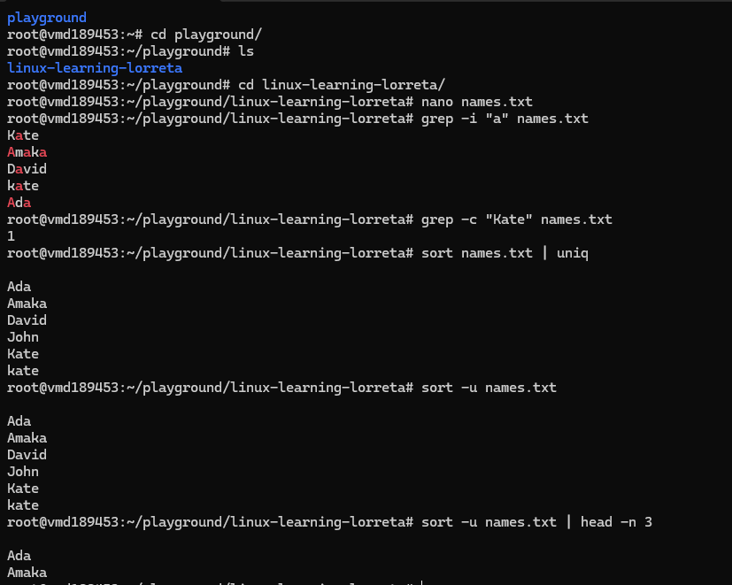

# Day 09 - PRACTICAL EXERCISES

## Objective

What was the goal for today?
- complete the practical exercises
---

## What I Learned

### Searching, Sorting, and Filtering
- Create a file called names.txt with several names (one per line): nano names.txt

- Display all names that contain the letter a (case-insensitive).

- Count how many lines contain a particular name e.g “Kate”.

- Sort the names alphabetically and remove duplicates.

- Show only the first 3 unique names.

---

## What I Built / Practiced

---

## Challenges Faced

- Forgetting Command Order: Doing things in the wrong sequence gives wrong results
- Overwriting Files Accidentally: Using > instead of >> can erase content
- Case Sensitivity Confusion: 
1. Kate ≠ kate in Linux
2. You might miss results without -i

---

## Key Takeaways

- Everything in Linux is text: you manipulate files using simple commands
- Commands can be combined (pipelining): small tools, powerful results
- Case sensitivity matters: use -i when needed

---

## Resources

- Linux file system[https://github.com/Najeeb-Sulaiman/linux-and-bash-scripting-guide/tree/main/02-linux-commands]

---

## Output

