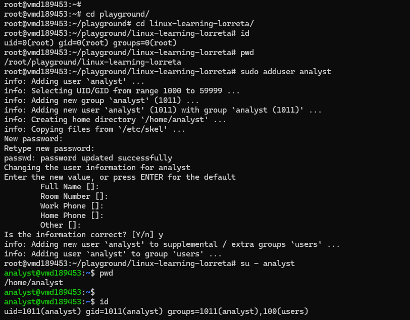

# Day 10 - Users and Groups

## Objective

What was the goal for today?

- understand users, what they can do or not do. And Groups

---

## What I Learned

- Linux needs order and controlled access because many users and services can use the same system at the same time. Users and groups are the structure that makes that possible.
- User: A person or process account, such as root, ubuntu, or airflow.

- Group: A collection of users who share certain access rights.

- Root: The superuser with full and unrestricted control over the system.

---

## What I Built / Practiced

- whoami: Tells my path

- id: Shows 
1. user ID (UID):0 meaning i am root. As the root, i do not need sudo. I have no restrictions. I cajn add, install, remove
2. Group ID (gid=0(root)): Shows i am in the group root. 
3. groups=0(root): This shows all groups I belong to. Right now, only root

- AddUser: to test users and groups I  created a user (sudo adduser analyst) and switched into it. 
1. su - analyst: switches to analyst and into the home directory of analyst
2. su analyst: switch to analyst but stay in same environment as root. 

As a user, I have restrictions. I cannot cd into the root. I cannot download unless given the sudo permission

---

## Challenges Faced

- I had a lot of reading around to understand the outputs of commands around users and groups
---

## Key Takeaways

- 
- 

---

## Resources

-  Linux file system[https://github.com/Najeeb-Sulaiman/linux-and-bash-scripting-guide/tree/main/02-linux-commands]

---

## Output

