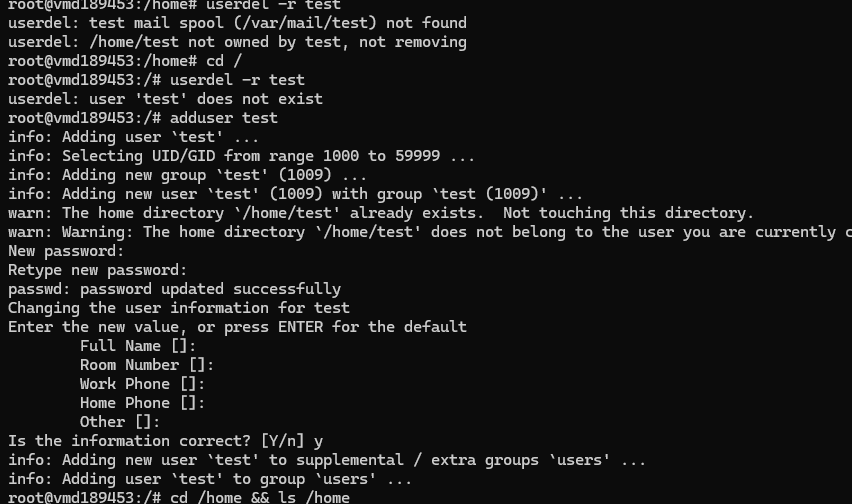
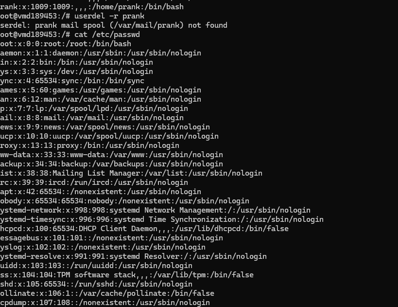

# Day 12 - Users and Groups contd.

## Objective

What was the goal for today?
- solve the challenges I faced yesterday. Try out the suggestions from the group.

---

## What I Learned

- I created a user using the "useradd". I confirmed this user was actually created using the:
1. getent passwd useradderr id useradderr
2. cat /etc/passwd

to delete, i can use userdel username.

2. For the user that was created using adduser and who has a directory in /home, Now i used userdel -r username, it deleted the user quite alright but still display the "no mail spooler" error. Is this normal?

This might look simole but a lot of trials went underneath.

---

## What I Built / Practiced

- adduser
- useradd
- userdel
- userdel -r
- cat /etc/passwd
- getent passwd username id username

---

## Challenges Faced

- a lot trials and errors to understand what happens behind the hood

---

## Key Takeaways

- userdel -r username works for both scenarios

---

## Resources

- -  Linux file system[https://github.com/Najeeb-Sulaiman/linux-and-bash-scripting-guide/tree/main/02-linux-commands]

---

## Output

