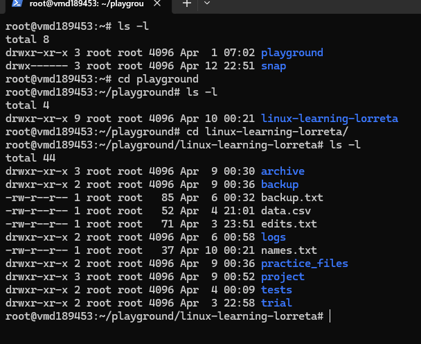

# Day 13 - LINUX FILE PERMISSIONS

## Objective

What was the goal for today?

- Understand what File Permissions Mean
---

## What I Learned

- Every file has:

1. Who can access it → (user, group, others)
2. What they can do → (read, write, execute)
- I treaded the first one the previous days. So you can refer to them
- what people can do?
1. r - read
2. w - write
3. x - execute

By defualt, the superuser has rwx (full access) permissions.

### How to change permissions

We chnage permissions using the chmod command. 
---

## What I Built / Practiced

- ls -l: this list the permissions on the directories and files. For instance: ls -l
- how to read the permissions for different files and directories
- gaim mastery of idemtifying the permissions granted to each file/folder

total 8
drwxr-xr-x 3 root root 4096 Apr  1 07:02 playground: the playground is a directory (d), the owner has full access (rwx), the group has read and execute (r-x), and others also have read and execute (r-x).

drwx------ 3 root root 4096 Apr 12 22:51 snap: Only the owner has full access and it is a directory. 

---

## Challenges Faced

- Understand what the "total" means? and size?

---

## Key Takeaways

- directories are defined with the letter d and files come with hyphen.
- 

---

## Resources

 Linux file system[https://github.com/Najeeb-Sulaiman/linux-and-bash-scripting-guide/tree/main/02-linux-commands]

---

---

## Output

