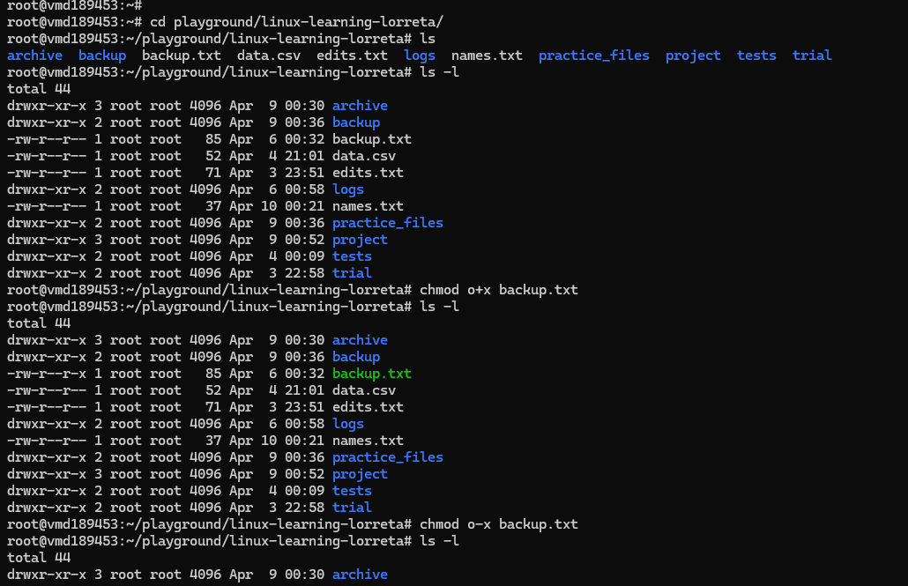
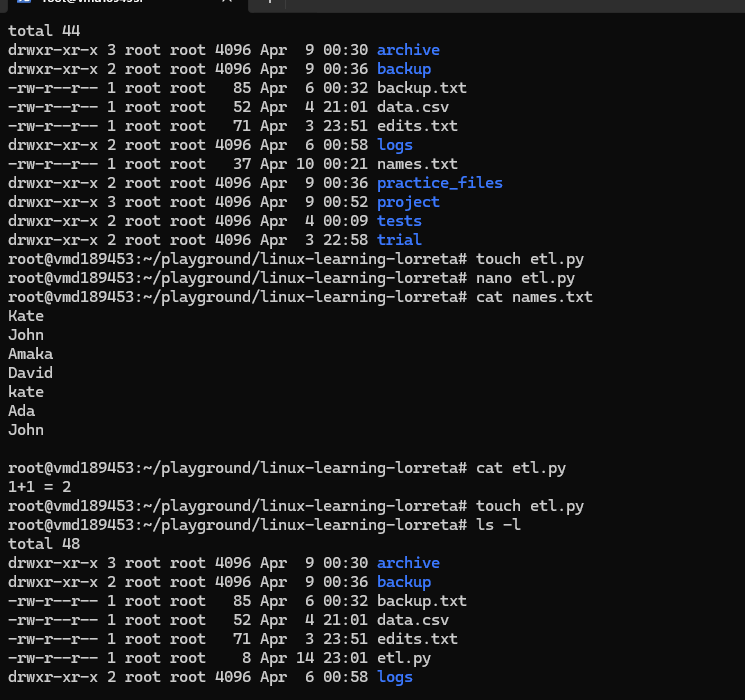
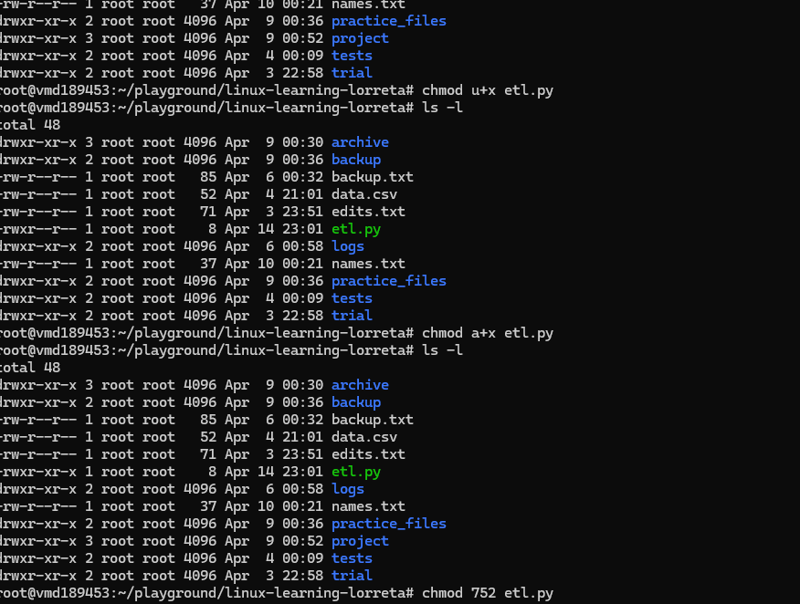

# Day 14 - File Permissions contd.

## Objective

What was the goal for today?
- Understand how to change permissions. 
- practice and hands-on granting and revoking rights

---

## What I Learned

- We use chmod to change permission. If you are granting, you use (+) and removal (-)
- We can either permissions using symbolic or octal mode. 

---

## What I Built / Practiced

- chmod g+w etl.py: Grant write access to the group for this file
- chmod a+x etl.py: Grant everyone executable access
- r = 4
- w = 2
- x = 1
- rwx = 7
- rw = 6

---

## Exercise:

- Make a script executable: 

- Give a group write access to a directory:  chmod g+r 
- Restrict access to a file completely (Only the owner can read/write.)
- Make a file publicly readable (Owner can read/write, others can only read.)

---

## Key Takeaways

- Every file has 3 levels of access
1. User (u) → owner
2. Group (g) → group members
3. Others (o) → everyone else

- There are only 3 permissions
1. r → read (view content / list directory)
2. w → write (modify / delete / create)
3. x → execute (run file / enter directory)

- You can read permissions from ls -l
- chmod = control access

You use chmod to decide who can do what on a file.

- Two ways to change permissions
1.  Symbolic (human-friendly)
2. Numeric (octal)
based on numbers:
- r = 4
- w = 2
- x = 1

---

## Resources

-  Linux file system[https://github.com/Najeeb-Sulaiman/linux-and-bash-scripting-guide/tree/main/02-linux-commands]

---

## Output

