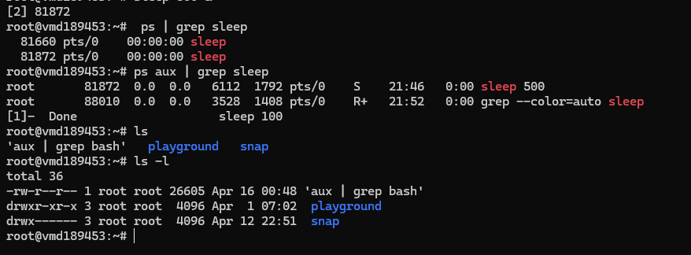

# Day 16 - Practice exercises on Process and Management

## Objective

What was the goal for today?
- Attempt as many hands-on as possible

---

## What I Learned

- Create & Observe processes. There are long processes and fast ones. Fast ones are like ls, ps, cd. Long ones are like sleep.
- Background Control: fg vs bg. When to use which? any advantage over each other?
- 

---

## What I Built / Practiced

- I largely used sleep to create processes because as of now it is safe and practical. Predictable is the right word. So it just stays alive for some specified seconds. Eg. sleep 60 starts a process, stays for 60 seconds and times out. Also it is a longer process than say ls which runs quickly and stops without allowing me to observe the process ad learn.
- 

---

## Challenges Faced

- Lack of electricity to actually do much.
- I ran the ps sleep command to list all sleep processes but encountered an error saying the PID must accompany. But in cases that i dont know the PID, then i ran ps | grep sleep. So now, it catches all processes involving sleep

---

## Key Takeaways

- 
- 

---

## Resources

- 

---

## Output

