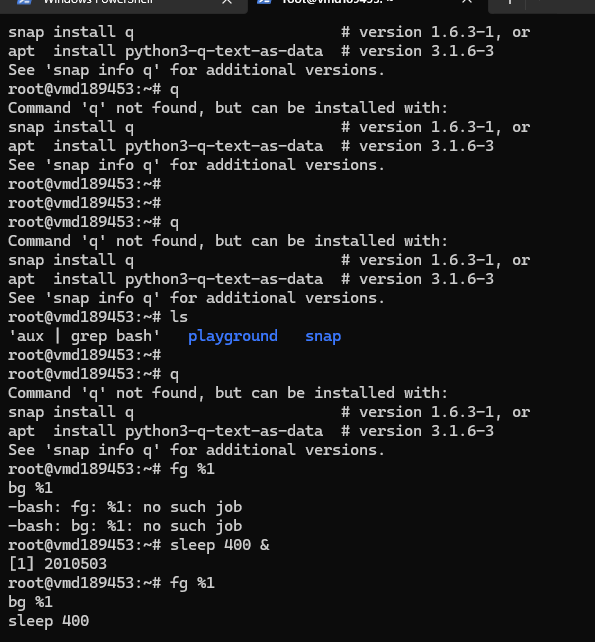
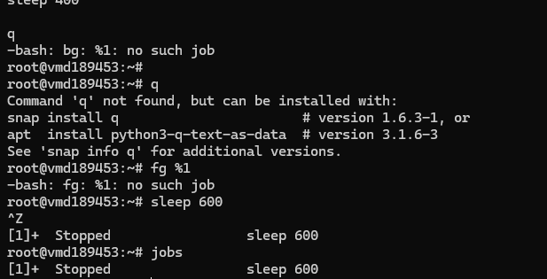

# Day 17 Practising File Management contd.

## Objective

What was the goal for today?
- Continue hands-on practice

---

## What I Learned

- Created and managed multiple background processes using:
1.  sleep 100 &
2. sleep 200 &
3.  1sleep 300 &

- Used jobs to track running and stopped processes.
1. Practiced switching between foreground and background:
- 

---

## What I Built / Practiced

---

## Challenges Faced
- Confusion between commands and control keys (e.g., typing bg instead of using Ctrl + Z first).
- Attempting to run commands while a foreground process was blocking the terminal.
- Initially misunderstanding the purpose of the jobs command as a history tracker.
- Difficulty identifying why some processes did not appear in ps due to running in the foreground and finishing quickly.

---

## Key Takeaways

- Not all commands behave the same; some require control keys rather than typed commands.
- jobs is a real-time tracker of current shell processes, not a record of past activities.
- Foreground processes block the terminal and must be controlled using keyboard shortcuts.
- Background processing allows multitasking and efficient workflow in Linux.
- Mastery of process control is essential for effective system management.

---

## Resources

- 

---

## Output

