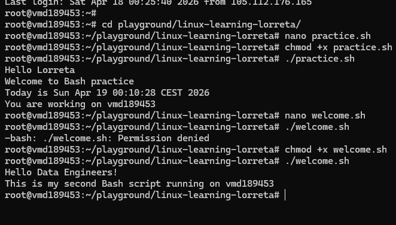

# Day 18 - Introduction to Bash Scripting  

## Objective  

**What was the goal for today?**  
- Read and understand the basics of Bash scripting and its relevance in data engineering  

---

## What I Learned  

- Bash scripting is a powerful tool used to automate repetitive tasks in a Linux environment  
- A Bash script is a text file containing a sequence of commands that execute automatically  
- Bash can be used alongside tools like Python, SQL, and Spark to manage data workflows  
- The structure of a Bash script includes a *shebang line* (`#!/bin/bash`) and executable commands  
- The `#!/bin/bash` line tells the system which interpreter to use  
- Commands like `echo`, `date`, and `hostname` can be used inside scripts  
- Bash shares similarities with programming languages like Python, making it easier to learn  

---

## What I Built / Practiced  

- Created my first Bash script using `nano`  
- Wrote a simple script to print messages and system information  
- Made the script executable using `chmod +x`  
- Successfully ran the script from the terminal  

---

## Challenges Faced  

- Understanding why the script would not run without changing file permissions  
- Getting familiar with terminal-based file creation and editing  
- Remembering the correct structure of a Bash script  
- At first, i wondered why dot (.) used for hidden files 
---

## Key Takeaways  

- Bash scripting is essential for automating tasks in data engineering workflows  
- Small commands can be combined to create powerful automation scripts  
- File permissions are critical when working with executable scripts  
- Learning Bash improves efficiency and productivity when working in Linux environments  

---

## Resources  
 -  Linux file system[https://github.com/Najeeb-Sulaiman/linux-and-bash-scripting-guide/tree/main/02-linux-commands]

---

## Output  
