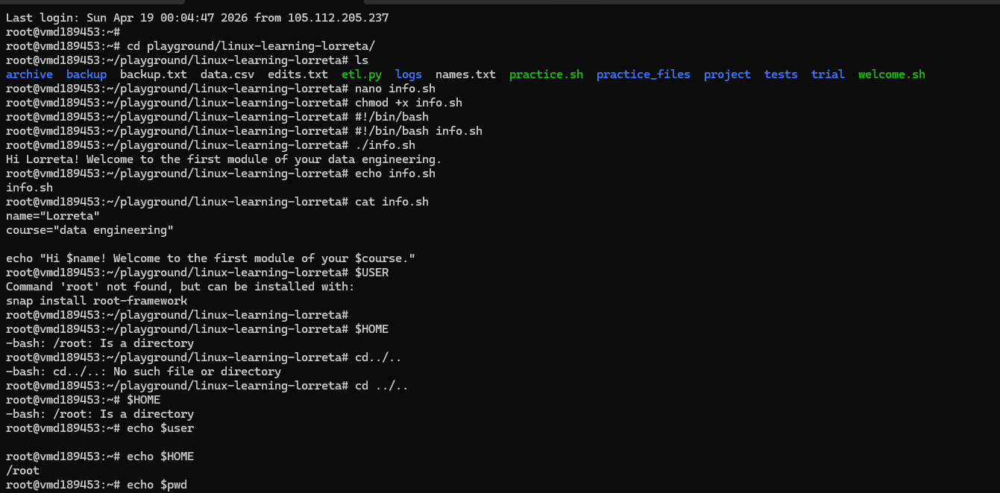

# Day 19 - Bash Variables and User Input

## Objective

Understand how to use variables, accept user input, work with command substitution, and apply environment variables in Bash scripting to make scripts dynamic and interactive.

---

## What I Learned

- How to declare and use variables in Bash using `name="value"` format  
- How to access variable values using `$variable`  
- How command substitution works using `$(command)`  
- How to take user input using the `read` command  
- Common environment variables like `$USER`, `$HOME`, `$PWD`, `$HOSTNAME`  
- How to use `export` to make variables available to child processes  
- How to use `readonly` to prevent variables from being modified  

---

## What I Built / Practiced

- Wrote a Bash script that stores and prints variables (name and role)  
- Practiced command substitution using `date`  
- Created a script that takes user input and creates a folder dynamically  
- Tested environment variables in the terminal  
- Experimented with `export` and `readonly` variables  

---

## Challenges Faced

- Forgetting that there must be no spaces around `=` when declaring variables  
- Understanding when to use `$variable` vs assigning `variable=value`  
- Getting comfortable with how user input is stored and reused in scripts  

---

## Key Takeaways

- Variables make Bash scripts reusable and flexible  
- `$()` allows scripts to dynamically capture system output  
- `read` is the simplest way to make scripts interactive  
- Environment variables help scripts adapt to any system  
- `export` extends variable usage beyond the current shell  
- `readonly` protects important values from accidental changes  

---

## Resources

- Bash scripting fundamentals (variables, input, environment variables)  
- Linux terminal practice (mkdir, echo, date commands)  
- Personal practice scripts created during session  

---

## Output

```bash
#!/bin/bash

name="Lorreta"
role="Data Engineer"

echo "Hello, $name! Your role is $role."

current_date=$(date)
echo "The current date and time is: $current_date"

